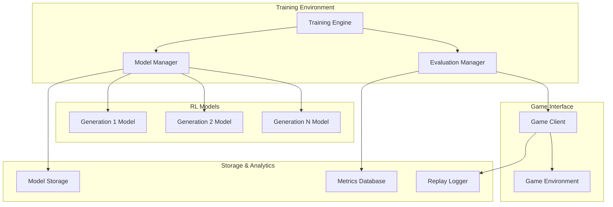
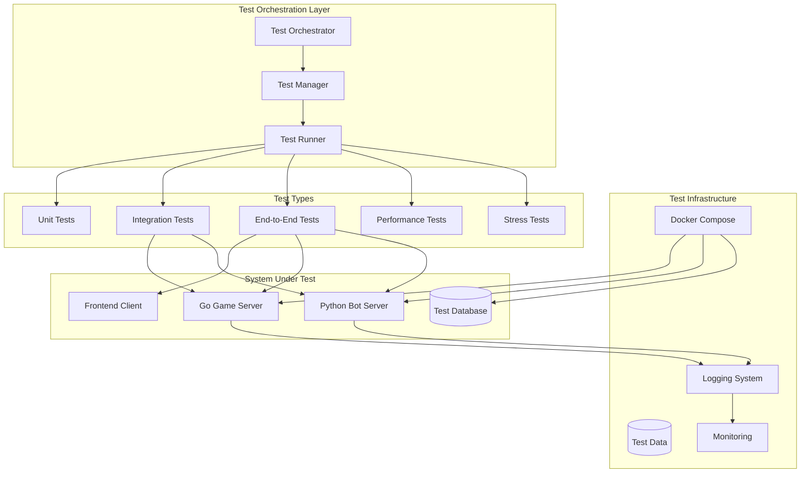

# Design Document

## Overview

The successive RL bot system will build upon the existing game client infrastructure to create a reinforcement learning framework that trains increasingly sophisticated bot players. The system uses a generational approach where each new RL model learns from and improves upon previous generations, creating a progressive improvement in bot performance.

The architecture leverages the existing `GameClient` class for game interaction and introduces new components for RL model training, evaluation, and management. The system will support multiple RL algorithms (DQN, PPO, A3C) and provide a unified interface for training successive generations of bots.

## Code Organization and Standards

### Project Structure
The project follows a hierarchical module structure with clear separation of concerns:

```
bot/
├── run_test.py                    # Main test runner script
├── requirements.txt               # Python dependencies
├── game_client.py                # Existing game client interface
├── rl_bot_system/                # Main RL bot system package
│   ├── __init__.py
│   ├── config/                   # Configuration management
│   │   ├── __init__.py
│   │   ├── training_config.py
│   │   └── tests/
│   ├── environment/              # RL environment wrapper
│   │   ├── __init__.py
│   │   ├── game_environment.py
│   │   ├── state_processors.py
│   │   ├── action_spaces.py
│   │   ├── reward_functions.py
│   │   └── tests/
│   ├── models/                   # RL model implementations
│   │   ├── __init__.py
│   │   ├── dqn.py
│   │   ├── ppo.py
│   │   └── tests/
│   ├── training/                 # Training engine and management
│   │   ├── __init__.py
│   │   ├── training_engine.py
│   │   ├── model_manager.py
│   │   └── tests/
│   ├── evaluation/               # Model evaluation framework
│   │   ├── __init__.py
│   │   ├── evaluator.py
│   │   └── tests/
│   ├── rules_based/              # Rules-based bot foundation
│   │   ├── __init__.py
│   │   ├── rules_based_bot.py
│   │   └── tests/
│   ├── server/                   # Bot server and game integration
│   │   ├── __init__.py
│   │   ├── bot_server.py
│   │   └── tests/
│   ├── storage/                  # Model and data persistence
│   │   ├── __init__.py
│   │   ├── model_storage.py
│   │   └── tests/
│   ├── utils/                    # Shared utilities
│   │   ├── __init__.py
│   │   ├── async_env.py
│   │   ├── metrics.py
│   │   └── tests/
│   └── tests/                    # Integration tests
│       ├── __init__.py
│       └── test_integration.py
└── example_bots/                 # Example bot implementations
    ├── rules_based_bot_example.py
    └── rl_bot_example.py
```

### Import Standards

**Absolute Imports Only**:
- All imports must use absolute paths from the project root
- Never use relative imports (e.g., `from .module import Class`)
- Never modify `sys.path` in production code or tests

**Correct Import Examples**:
```python
# Correct - absolute imports
from bot.rl_bot_system.environment import GameEnvironment
from bot.rl_bot_system.training.training_engine import TrainingEngine
from bot.game_client import GameClient

# Incorrect - relative imports
from .environment import GameEnvironment  # DON'T DO THIS
from ..training.training_engine import TrainingEngine  # DON'T DO THIS
```

**Import Organization**:
```python
# Standard library imports
import asyncio
import logging
from typing import Dict, Any, Optional

# Third-party imports
import numpy as np
import torch
import gymnasium as gym

# Project imports
from bot.rl_bot_system.environment import GameEnvironment
from bot.rl_bot_system.models.dqn import DQNModel
from bot.game_client import GameClient
```

### Module Dependencies

**Dependency Flow**:
- Higher-level modules can import from lower-level modules
- Avoid circular dependencies between modules
- Use dependency injection for external services

**Allowed Dependencies**:
```
training/ → models/, environment/, storage/, utils/
evaluation/ → models/, environment/, storage/, utils/
environment/ → utils/
models/ → utils/
server/ → training/, evaluation/, rules_based/, utils/
rules_based/ → utils/
```

## Architecture

### High-Level Architecture



### Component Architecture

The system consists of several key components:

1. **Rules-Based Bot Foundation**: Provides baseline behavior and initial training opponents
2. **Game Speed Controller**: Accelerates game simulation for faster training
3. **Training Spectator Interface**: Enables browser-based observation of training sessions
4. **Player Bot Integration**: Allows players to add bots to games through browser UI
5. **RL Training Engine**: Orchestrates the training process for successive model generations
6. **Model Manager**: Handles model lifecycle, versioning, and knowledge transfer between generations
7. **Game Environment Wrapper**: Adapts the existing GameClient for RL training
8. **Evaluation Framework**: Compares model performance across generations
9. **Replay System**: Records and analyzes game episodes for training and evaluation

## Components and Interfaces

### 1. Rules-Based Bot Foundation

**Purpose**: Provides intelligent baseline behavior and serves as initial training opponents

**Key Methods**:
- `analyze_game_state(state)`: Processes current game situation
- `select_action(state, available_actions)`: Chooses actions based on predefined rules
- `update_strategy(game_result)`: Adjusts rule priorities based on outcomes
- `get_difficulty_level()`: Returns current bot difficulty setting

**Rule Categories**:
- **Survival Rules**: Avoid projectiles, stay in bounds, maintain health
- **Combat Rules**: Target enemies, aim projectiles, use cover
- **Strategic Rules**: Control territory, collect power-ups, time attacks
- **Adaptive Rules**: Counter opponent patterns, adjust aggression

**Difficulty Scaling**:
- **Beginner**: Basic movement and shooting with reaction delays
- **Intermediate**: Improved aim, basic strategy, moderate reaction time
- **Advanced**: Complex strategies, quick reactions, pattern recognition
- **Expert**: Near-optimal play, advanced tactics, minimal delays

### 2. Game Speed Controller

**Purpose**: Accelerates game simulation for faster RL training while maintaining game physics accuracy

**Key Methods**:
- `set_simulation_speed(multiplier)`: Sets game speed multiplier (1x to 100x)
- `enable_headless_mode()`: Disables rendering for maximum speed
- `batch_simulate_episodes(episodes, speed)`: Runs multiple episodes in parallel
- `sync_with_realtime()`: Returns to normal speed for human evaluation
- `create_spectator_room(training_session)`: Creates spectatable training room
- `get_spectator_info(session_id)`: Returns room code and connection details for spectators

**Speed Modes**:
- **Real-time (1x)**: Normal game speed for human players and final evaluation
- **Training (10-50x)**: Accelerated speed for RL training with visual feedback
- **Headless (50-100x)**: Maximum speed with no rendering for bulk training
- **Batch Mode**: Parallel episode execution for distributed training
- **Spectator Mode**: Real-time or slowed-down playback for human observation

**Implementation Approach**:

*Client-Side Components*:
- **Training Mode Interface**: API to request accelerated game sessions
- **Direct State Access**: Bypass WebSocket for faster state retrieval
- **Batch Episode Management**: Queue and manage multiple concurrent episodes

*Server-Side Components*:
- **Game Loop Acceleration**: Configurable tick rate and frame timing
- **Headless Game Instances**: Game sessions without rendering pipeline
- **Training Room Management**: Dedicated rooms for bot training with speed controls
- **Physics Time Scaling**: Maintain accurate physics at accelerated speeds
- **Memory-Optimized Game State**: Efficient state representation for rapid access
- **Training API Endpoints**: REST/WebSocket APIs for training session management

**Server-Side Modifications Required**:
- **Backend Game Engine**: Modify game loop to support variable tick rates
- **Training Room Types**: New room type specifically for bot training
- **Headless Mode**: Game instances that run without graphics rendering
- **State Serialization**: Optimized game state format for ML consumption
- **Resource Management**: Handle multiple concurrent training sessions
- **Training APIs**: New endpoints for training session control and monitoring
- **Spectator Integration**: Enable browser-based spectating of training sessions

**Configuration**:
- Maximum safe speed multiplier based on system capabilities
- Automatic speed adjustment based on training performance
- Fallback to slower speeds if physics accuracy degrades
- Speed ramping for gradual acceleration during training
- Server resource limits for concurrent training sessions

### 3. Training Spectator Interface

**Purpose**: Enables real-time observation of bot training and evaluation through browser-based game client

**Key Methods**:
- `create_spectator_session(training_session, speed_mode)`: Creates spectatable training room
- `get_room_info(session_id)`: Returns room code, password, and connection details
- `set_spectator_speed(room_id, speed)`: Adjusts playback speed for spectators
- `broadcast_training_metrics(room_id, metrics)`: Sends training data to spectator UI
- `enable_replay_mode(episode_data)`: Allows spectating of recorded episodes

**Spectator Features**:
- **Live Training Observation**: Watch bots train in real-time or accelerated speed
- **Training Metrics Overlay**: Display current reward, episode count, model generation
- **Model Comparison Mode**: Side-by-side comparison of different model generations
- **Episode Replay**: Review specific training episodes with pause/rewind controls
- **Performance Graphs**: Real-time charts of training progress and metrics

**Integration with Existing Spectator Mode**:
- **Room Code Generation**: Training sessions automatically generate spectator room codes
- **Access Control**: Optional password protection for training sessions
- **Spectator Limits**: Configurable maximum number of concurrent spectators
- **Bandwidth Optimization**: Reduced update frequency for spectators during high-speed training

**Training Session Information Display**:
- Current model generation and algorithm
- Training episode count and duration
- Real-time performance metrics (reward, win rate, etc.)
- Bot decision-making visualization (action probabilities, state values)
- Comparison with previous generations

### 4. Player Bot Integration

**Purpose**: Enables players to add AI bots to regular game sessions through the browser-based game client

**Key Methods**:

*Game Server APIs*:
- `get_available_bots()`: Returns list of available bot types and difficulty levels
- `add_bot_to_room(room_id, bot_config)`: Requests bot addition to game room
- `remove_bot_from_room(room_id, bot_id)`: Removes a bot from the game
- `get_bot_status(room_id)`: Returns information about active bots in the room

*Python Bot Server APIs*:
- `spawn_bot(bot_type, difficulty, room_info)`: Creates new bot instance
- `configure_bot_difficulty(bot_id, difficulty)`: Adjusts bot skill level mid-game
- `terminate_bot(bot_id)`: Cleanly shuts down bot instance
- `get_bot_health()`: Returns bot server status and resource usage
- `handle_player_disconnect(room_id, player_id)`: Processes player leave events
- `cleanup_empty_rooms()`: Removes bots from rooms with no human players

**Browser UI Integration**:
- **Bot Selection Menu**: Dropdown/grid showing available bot types and generations
- **Difficulty Slider**: Easy adjustment of bot skill level (Beginner to Expert)
- **Bot Management Panel**: Add/remove bots, view bot status, adjust settings
- **Bot Information Display**: Show bot generation, algorithm, win rate statistics
- **Quick Add Buttons**: One-click addition of common bot configurations

**Bot Types Available to Players**:
- **Rules-Based Bots**: Traditional AI with configurable difficulty levels
- **RL Generation Bots**: Trained models from different generations (Gen 1, Gen 2, etc.)
- **Hybrid Bots**: Combination of rules-based and RL behaviors
- **Specialized Bots**: Bots trained for specific playstyles (aggressive, defensive, etc.)

**Game Integration Features**:
- **Seamless Join/Leave**: Bots can join ongoing games without disruption
- **Player Replacement**: Bots can replace disconnected players
- **Balanced Teams**: Automatic team balancing when adding/removing bots
- **Custom Bot Names**: Players can name their bot opponents
- **Bot Performance Tracking**: Track wins/losses against specific bot types
- **Auto-Cleanup**: Bots automatically leave when all human players disconnect
- **Resource Conservation**: Prevents orphaned bot-only games from consuming resources

**Architecture Requirements**:

*Python Bot Server*:
- **Bot Instance Management**: Spawn and manage individual bot processes
- **Model Loading**: Load and cache trained RL models and rules-based bots
- **Game Client Pool**: Maintain pool of GameClient connections for bot players
- **Resource Management**: Monitor CPU/memory usage, scale bot instances
- **Bot Lifecycle**: Handle bot creation, configuration, and cleanup
- **Auto-Cleanup**: Automatically disconnect bots when all human players leave

*Game Server Integration*:
- **Bot Registration API**: Register available bots with the main game server
- **Room Assignment**: Coordinate bot placement in game rooms
- **Bot Status Tracking**: Monitor which bots are active in which rooms
- **Health Monitoring**: Ensure bot server connectivity and responsiveness

*Communication Flow*:
```
Browser UI → Game Server → Python Bot Server → GameClient → Game Server
```

**Server-Side Requirements**:
- **Bot Pool Management**: Maintain pool of available bot instances
- **Room Bot Tracking**: Track which bots are active in which rooms
- **Resource Allocation**: Manage computational resources for bot players
- **Bot State Synchronization**: Ensure bot actions are properly synchronized with game state
- **Python Bot Server**: Dedicated service for running RL models and managing bot instances

### 5. RL Training Engine

**Purpose**: Central orchestrator for training successive RL models

**Key Methods**:
- `train_next_generation(previous_model, training_config)`: Trains a new model generation
- `evaluate_generation(model, evaluation_episodes)`: Evaluates model performance
- `should_promote_model(current_best, candidate)`: Determines if a new model should replace the current best
- `initialize_from_rules_bot(rules_bot)`: Creates first RL generation using rules-based behavior as guidance
- `select_training_cohort(generation, cohort_size)`: Selects opponent bots for training
- `configure_enemy_count(min_enemies, max_enemies)`: Sets variable opponent numbers per episode

**Training Progression**:
- **Generation 0**: Rules-based bot serves as baseline and initial opponent
- **Generation 1**: RL model trained against rules-based bot with behavior cloning initialization
- **Generation N**: Each successive model trains against a cohort of previous generations + rules-based opponents

**Cohort Training Configuration**:
- **Opponent Pool Size**: Configurable number of previous bot generations to include (e.g., last 3-5 generations)
- **Enemy Count**: Variable number of opponents per training episode (1v1, 1v2, 1v3, etc.)
- **Opponent Selection**: Random sampling from cohort, weighted by performance, or round-robin
- **Difficulty Progression**: Start with easier opponents, gradually include stronger ones
- **Multi-Agent Scenarios**: Train against teams of mixed bot generations

**Configuration**:
- Training algorithms (DQN, PPO, A3C)
- Hyperparameters per generation
- Training episode limits
- Evaluation criteria
- Cohort size (number of previous generations to train against)
- Enemy count range (min/max opponents per episode)
- Opponent selection strategy (random, weighted, round-robin)

### 6. Model Manager

**Purpose**: Manages model lifecycle, storage, and knowledge transfer

**Key Methods**:
- `save_model(model, generation, metadata)`: Persists trained models with versioning
- `load_model(generation)`: Loads a specific model generation
- `transfer_knowledge(source_model, target_model)`: Transfers learned weights/policies
- `get_best_model()`: Returns the current best-performing model

**Storage Structure**:
```
models/
├── generation_1/
│   ├── model.pth
│   ├── config.json
│   └── metrics.json
├── generation_2/
│   ├── model.pth
│   ├── config.json
│   └── metrics.json
└── current_best/
    └── symlink to best generation
```

### 7. Game Environment Wrapper

**Purpose**: Adapts the existing GameClient for RL training

**Key Methods**:
- `reset()`: Starts a new game episode
- `step(action)`: Executes an action and returns (state, reward, done, info)
- `get_state()`: Extracts game state features for the RL model
- `calculate_reward(game_state, action, result)`: Computes reward signals using configurable reward functions
- `set_reward_function(reward_type, parameters)`: Configures which reward function to use
- `get_available_reward_functions()`: Returns list of supported reward function types
- `set_training_mode(enabled)`: Switches between training (accelerated) and evaluation (real-time) modes
- `set_state_representation(representation_type)`: Configures how game state is encoded for the model
- `register_state_processor(processor)`: Adds custom state processing functions
- `get_available_representations()`: Returns list of supported state representation types

**State Representation Options**:

*Raw Coordinate Representation*:
- Player position (x, y) and velocity (vx, vy)
- Enemy positions and velocities
- Projectile locations, velocities, and types
- Game boundaries and platform positions
- Power-up locations and types

*Grid-Based Representation*:
- Discretized game world as 2D grid
- Cell values indicating player, enemies, projectiles, platforms
- Multi-channel representation for different entity types
- Spatial relationships preserved in grid format

*Feature Vector Representation*:
- Distances to nearest enemies, projectiles, platforms
- Relative positions and velocities
- Health, ammunition, power-up status
- Tactical features (cover availability, escape routes)

*Hybrid Representations*:
- Combination of coordinate and feature data
- Multi-modal inputs (coordinate + tactical features)
- Hierarchical state encoding (local + global features)
- Custom domain-specific representations

**State Processing Pipeline**:
- **Raw State Extraction**: Get complete game state from server
- **Representation Selection**: Apply chosen state encoding method
- **Normalization**: Scale features to appropriate ranges
- **History Integration**: Include temporal information from previous frames
- **Custom Processing**: Apply domain-specific transformations

**Action Space Options**:

*Available Game Inputs* (from GameClient):
- **Keyboard**: Press/release W, A, S, D keys
- **Mouse Left**: Click/hold/release for shooting at (x, y) coordinates (hold to charge shot)
- **Mouse Right**: Click to cancel currently charging shot (only relevant when left-click is held)
- **Timing**: Actions can be held for variable durations

*Discrete Action Space*:
- **Basic Actions**: {press_A, release_A, press_D, release_D, press_W, release_W, press_S, release_S, no_action}
- **Mouse Actions**: {left_click, hold_left_click, release_left_click, right_click_cancel, no_mouse_action}
- **Combined Actions**: {press_A_and_left_click, press_D_and_hold_left_click, move_and_cancel_shot, etc.}
- **Simplified Actions**: {move_left, move_right, jump, shoot, no_action} (mapped to appropriate key combinations)

*Continuous Action Space*:
- **Movement**: [-1.0, 1.0] mapped to A/D key press intensity and duration
- **Mouse Position**: (x, y) coordinates for aiming [0.0, 1.0] normalized screen space
- **Action Duration**: [0, 1.0] for how long to hold keys/mouse buttons

*Hybrid Action Space*:
- **Discrete Movement + Continuous Aiming**: W/A/S/D keys + continuous mouse (x, y)
- **Discrete Actions + Continuous Timing**: Fixed actions with variable hold durations
- **Hierarchical Actions**: High-level intentions mapped to low-level input sequences

**Reward Function Options**:

*Sparse Reward Functions*:
- **Win/Loss Only**: +1 for win, -1 for loss, 0 otherwise
- **Survival Based**: +1 for surviving, -1 for death, 0 for ongoing
- **Objective Based**: Rewards only for achieving specific game objectives

*Dense Reward Functions*:
- **Health Differential**: Reward based on health gained/lost relative to opponents
- **Damage Dealt**: Positive reward for dealing damage to enemies
- **Positional Advantage**: Rewards for controlling strategic positions
- **Resource Collection**: Rewards for collecting power-ups and ammunition

*Shaped Reward Functions*:
- **Distance to Enemy**: Negative reward for being too far from combat
- **Aim Accuracy**: Rewards for shots that hit vs miss
- **Movement Efficiency**: Penalties for excessive or inefficient movement
- **Tactical Positioning**: Rewards for using cover, high ground, etc.

*Horizon-Based Rewards*:
- **Short-Term (1-5 steps)**: Immediate action consequences
- **Medium-Term (10-50 steps)**: Tactical sequence rewards
- **Long-Term (100+ steps)**: Strategic game-level outcomes
- **Multi-Horizon**: Weighted combination of different time scales

*Curriculum Reward Functions*:
- **Progressive Complexity**: Start with simple rewards, add complexity over time
- **Difficulty Scaling**: Adjust reward sensitivity based on bot skill level
- **Opponent-Adaptive**: Modify rewards based on opponent strength

**Reward Function Configuration**:
```python
reward_config = {
    "primary_function": "health_differential",
    "secondary_functions": ["aim_accuracy", "survival"],
    "weights": [0.7, 0.2, 0.1],
    "horizon_weights": {
        "short_term": 0.5,
        "medium_term": 0.3, 
        "long_term": 0.2
    },
    "curriculum_stage": "intermediate",
    "normalization": "z_score"
}
```

**Reward Engineering Features**:
- **Multi-Objective**: Combine multiple reward signals with configurable weights
- **Temporal Discounting**: Apply different discount factors for different reward types
- **Normalization**: Standardize reward scales across different function types
- **Clipping**: Prevent extreme reward values from destabilizing training
- **Exploration Bonuses**: Additional rewards for novel states or actions

**Experimental Configuration**:
- **A/B Testing Framework**: Compare different representations and reward functions on same models
- **Performance Metrics**: Track learning speed, final performance, stability
- **Representation Switching**: Change representations between training generations
- **Reward Function Evolution**: Modify reward functions as bots become more sophisticated
- **Custom Processors**: Plugin architecture for new state representations and reward functions

### 8. Evaluation Framework

**Purpose**: Compares and validates model performance across generations

**Key Methods**:
- `run_evaluation(model, opponent_models, episodes)`: Runs evaluation matches
- `calculate_metrics(game_results)`: Computes performance metrics
- `compare_generations(model_a, model_b)`: Statistical comparison of models
- `generate_report(evaluation_results)`: Creates performance reports

**Metrics Tracked**:
- Win rate against previous generations
- Average episode reward
- Game completion time
- Strategic diversity (action entropy)
- Learning stability (reward variance)

### 9. Replay System

**Purpose**: Records, stores, and analyzes game episodes

**Key Methods**:
- `record_episode(states, actions, rewards)`: Stores episode data
- `get_training_batch(batch_size)`: Retrieves training samples
- `analyze_behavior(model, episodes)`: Analyzes decision patterns
- `export_replay(episode_id, format)`: Exports episode for analysis

## Data Models

### RLModel
```python
class RLModel:
    generation: int
    algorithm: str  # 'DQN', 'PPO', 'A3C'
    network_architecture: dict
    hyperparameters: dict
    training_episodes: int
    performance_metrics: dict
    parent_generation: Optional[int]
    created_at: datetime
    model_path: str
```

### TrainingSession
```python
class TrainingSession:
    session_id: str
    model_generation: int
    start_time: datetime
    end_time: Optional[datetime]
    episodes_completed: int
    current_reward: float
    best_reward: float
    training_config: dict
    status: str  # 'running', 'completed', 'failed'
```

### GameEpisode
```python
class GameEpisode:
    episode_id: str
    model_generation: int
    states: List[dict]
    actions: List[int]
    rewards: List[float]
    total_reward: float
    episode_length: int
    game_result: str  # 'win', 'loss', 'draw'
    opponent_info: dict
```

### EvaluationResult
```python
class EvaluationResult:
    model_generation: int
    opponent_generations: List[int]
    total_games: int
    wins: int
    losses: int
    draws: int
    average_reward: float
    win_rate: float
    performance_metrics: dict
    evaluation_date: datetime
```

## Error Handling

### Training Failures
- **Model Convergence Issues**: Implement early stopping and hyperparameter adjustment
- **Resource Exhaustion**: Queue management and resource monitoring
- **Game Connection Failures**: Retry logic and fallback to simulation mode

### Model Performance Degradation
- **Performance Regression**: Automatic rollback to previous best model
- **Overfitting Detection**: Validation against diverse opponent sets
- **Training Instability**: Gradient clipping and learning rate scheduling

### System Failures
- **Storage Failures**: Model backup and recovery mechanisms
- **Memory Leaks**: Automatic cleanup and resource monitoring
- **Concurrent Training**: Lock management and resource allocation

## Testing Strategy

### Testing Guidelines and Standards

**Test Organization**:
- All unit tests must be placed in local `/tests/` folders within each module
- Tests should be designed to run with the `run_test.py` (pytest) script
- Test files should follow the naming convention `test_*.py`
- Test classes should follow the naming convention `Test*`

**Import Standards**:
- Use absolute imports throughout the codebase; avoid relative imports
- Do not append to `sys.path` in test files or production code
- Import from the root package using full module paths (e.g., `from bot.rl_bot_system.environment import GameEnvironment`)

**Mocking Guidelines**:
- Minimize the use of mocks except where there are external dependencies
- Mock only external systems that require running services (e.g., game client requiring a running game server)
- Prefer real implementations and dependency injection for internal components
- When mocking is necessary, use `unittest.mock` or `pytest-mock`

**Test Structure Example**:
```
bot/rl_bot_system/
├── environment/
│   ├── __init__.py
│   ├── game_environment.py
│   ├── state_processors.py
│   ├── action_spaces.py
│   ├── reward_functions.py
│   └── tests/
│       ├── __init__.py
│       ├── test_game_environment.py
│       ├── test_state_processors.py
│       ├── test_action_spaces.py
│       └── test_reward_functions.py
├── training/
│   ├── __init__.py
│   ├── training_engine.py
│   └── tests/
│       ├── __init__.py
│       └── test_training_engine.py
└── tests/
    ├── __init__.py
    └── test_integration.py
```

### Unit Testing

**Model Components**:
- Test individual RL algorithms and neural networks without external dependencies
- Use synthetic data and controlled environments for algorithm validation
- Test model serialization/deserialization without file system dependencies
- Validate hyperparameter handling and configuration management

**Environment Wrapper**:
- Test state extraction and reward calculation with mock game states
- Validate action space conversions and input mappings
- Test different state representations (coordinate, grid, feature vector)
- Mock only the GameClient connection, use real game state processing

**Evaluation Metrics**:
- Test performance calculation accuracy with known input/output pairs
- Validate statistical comparisons and confidence intervals
- Test metric aggregation and reporting functions
- Use deterministic test data to ensure reproducible results

**Storage Operations**:
- Test model save/load functionality with temporary directories
- Validate configuration serialization and deserialization
- Test model versioning and metadata handling
- Use in-memory storage for fast test execution where possible

**Rules-Based Bot Logic**:
- Test decision-making algorithms with controlled game states
- Validate difficulty scaling and adaptive behavior
- Test rule priority systems and conflict resolution
- Use real game state structures, mock only external game interactions

### Integration Testing

**End-to-End Training**:
- Test complete training pipeline from initialization to model output
- Use small-scale training runs with limited episodes for speed
- Validate model improvement over successive generations
- Mock game server connections, use real training algorithms

**Model Succession**:
- Test knowledge transfer between generations with real models
- Validate model compatibility across different generations
- Test evaluation framework with multiple model generations
- Use lightweight models for faster test execution

**Game Integration**:
- Test bot behavior integration with mock game sessions
- Validate action execution and state observation pipelines
- Test spectator interface and training session management
- Mock WebSocket connections, use real bot decision logic

**Performance Comparison**:
- Test evaluation framework accuracy with known performance differences
- Validate statistical significance testing and confidence intervals
- Test cross-generation compatibility and fair comparison metrics
- Use deterministic models for reproducible comparison results

### Performance Testing

**Training Speed**:
- Benchmark training time per episode and generation with real algorithms
- Test training acceleration and speed controller functionality
- Validate memory usage patterns during extended training sessions
- Use profiling tools to identify performance bottlenecks

**Concurrent Training**:
- Test multiple simultaneous training sessions with resource management
- Validate model isolation and independent training progression
- Test resource allocation and cleanup mechanisms
- Use lightweight models to enable concurrent testing

**Model Inference**:
- Measure bot response time during gameplay simulation
- Test action selection speed under different state representations
- Validate real-time performance requirements for game integration
- Benchmark different model architectures and sizes

### Validation Testing

**Model Quality**:
- Validate that successive models show measurable improvement
- Test against baseline rules-based bots for performance benchmarking
- Validate learning curves and convergence behavior
- Use statistical tests to confirm improvement significance

**Behavioral Analysis**:
- Test bot decision-making patterns for intelligent gameplay
- Validate strategic diversity and tactical adaptation
- Test behavioral consistency across different game scenarios
- Analyze action distributions and decision rationale

**Stability Testing**:
- Run extended training sessions to test for performance degradation
- Validate model stability across different opponent configurations
- Test recovery from training failures and edge cases
- Monitor resource usage patterns over long-running sessions

**Cross-Generation Compatibility**:
- Test model loading and execution across different software versions
- Validate backward compatibility for older model generations
- Test evaluation fairness when comparing models from different training runs
- Ensure consistent behavior across different hardware configurations

### Test Execution and CI/CD

**Local Testing**:
- All tests should run via `python run_test.py` from the project root
- Tests should complete within reasonable time limits (< 5 minutes for unit tests)
- Integration tests may have longer timeouts but should remain under 30 minutes
- Performance tests should be tagged separately for optional execution

**Test Data Management**:
- Use fixtures and factory patterns for test data generation
- Minimize external file dependencies; prefer in-memory test data
- Use temporary directories for tests requiring file system operations
- Clean up test artifacts automatically after test completion

**Continuous Integration**:
- Unit tests should run on every commit and pull request
- Integration tests should run on merge to main branch
- Performance tests should run on scheduled basis (nightly/weekly)
- Test results should be reported with clear pass/fail status and coverage metrics

## Integration Testing Architecture

### Overview

The integration testing system validates the complete bot-game server ecosystem, ensuring that bot actions produce reasonable game states and that all system components communicate correctly. The testing architecture spans multiple services and validates both functional correctness and performance characteristics.

### Testing Architecture Components



### Integration Test Framework Design

#### Test Environment Management

**Multi-Service Test Environment**:
- **Docker Compose Configuration**: Orchestrates Go game server, Python bot server, and test database
- **Service Health Checking**: Validates all services are ready before test execution
- **Network Isolation**: Each test run uses isolated network namespaces
- **Resource Management**: Configurable resource limits for consistent test performance
- **Parallel Execution**: Support for concurrent test suites with isolated environments

**Environment Lifecycle**:
```python
class IntegrationTestEnvironment:
    def setup(self):
        # Start Go game server with test configuration
        # Start Python bot server with test models
        # Initialize test database with seed data
        # Verify all services are healthy and responsive
        
    def teardown(self):
        # Collect logs and metrics from all services
        # Clean up test data and temporary files
        # Stop all services gracefully
        # Generate test environment report
```

#### Bot-Game Server Communication Testing

**Communication Validation Framework**:
- **Message Serialization Testing**: Validates JSON/WebSocket message formats between services
- **API Contract Testing**: Ensures API compatibility between Go and Python servers
- **Real-time Communication Testing**: Validates WebSocket message ordering and delivery
- **Error Propagation Testing**: Tests error handling across service boundaries

**Game State Consistency Validation**:
```python
class GameStateValidator:
    def validate_bot_action_result(self, action, pre_state, post_state):
        # Validate physics consistency (position, velocity changes)
        # Check collision detection accuracy
        # Verify game rule enforcement
        # Validate state synchronization across clients
        
    def validate_multi_bot_interactions(self, bots, game_states):
        # Test bot-to-bot combat mechanics
        # Validate projectile trajectories and impacts
        # Check team coordination and friendly fire rules
        # Verify resource sharing and competition
```

#### Performance and Load Testing

**Bot Performance Metrics**:
- **Decision Speed**: Time from game state update to bot action
- **Action Accuracy**: Percentage of valid vs invalid actions attempted
- **Resource Usage**: CPU, memory, and network utilization per bot
- **Scalability**: Performance degradation with increasing bot count

**System Load Testing**:
```python
class LoadTestScenario:
    def concurrent_bot_sessions(self, bot_count, duration):
        # Spawn multiple bots across different rooms
        # Monitor system resource usage
        # Validate game performance under load
        # Test graceful degradation scenarios
        
    def training_session_load(self, concurrent_sessions):
        # Run multiple training sessions simultaneously
        # Test resource allocation and queuing
        # Validate training performance metrics
        # Check system stability over extended periods
```

### Test Data Management and Validation

#### Game Scenario Generation

**Deterministic Test Scenarios**:
- **Predefined Game States**: Known initial conditions for reproducible tests
- **Action Sequences**: Scripted bot behaviors for consistent testing
- **Expected Outcomes**: Validated game state transitions and results
- **Edge Case Scenarios**: Boundary conditions and error states

**Dynamic Scenario Generation**:
```python
class ScenarioGenerator:
    def generate_combat_scenario(self, bot_count, difficulty):
        # Create balanced starting positions
        # Set appropriate weapon and health distributions
        # Define victory conditions and time limits
        # Generate opponent behavior patterns
        
    def generate_training_scenario(self, generation, opponents):
        # Select appropriate opponent cohort
        # Configure reward functions and objectives
        # Set training episode parameters
        # Define evaluation criteria
```

#### Test Result Validation

**Automated Validation Rules**:
- **Physics Validation**: Ensure game physics remain consistent at all speeds
- **Fairness Validation**: Verify balanced gameplay and equal opportunities
- **Performance Validation**: Check response times and resource usage
- **Behavioral Validation**: Ensure bot actions are reasonable and strategic

**Validation Pipeline**:
```python
class TestResultValidator:
    def validate_game_outcome(self, game_session):
        # Check for physics violations or impossible states
        # Validate combat mechanics and damage calculations
        # Verify proper game termination conditions
        # Analyze bot decision-making patterns
        
    def validate_training_progress(self, training_session):
        # Check learning curve progression
        # Validate model performance improvements
        # Verify training stability and convergence
        # Compare against baseline performance metrics
```

### Error Handling and Recovery Testing

#### Failure Scenario Testing

**Network Failure Scenarios**:
- **Partial Network Partitions**: Test behavior when services can't communicate
- **Intermittent Connectivity**: Validate reconnection and message recovery
- **High Latency Conditions**: Test performance under network stress
- **Bandwidth Limitations**: Validate graceful degradation with limited bandwidth

**Service Failure Scenarios**:
```python
class FailureScenarioTester:
    def test_python_server_failure(self):
        # Stop Python bot server during active games
        # Validate Go server error handling
        # Test bot cleanup and resource recovery
        # Verify user notification and fallback behavior
        
    def test_database_failure(self):
        # Simulate database connectivity issues
        # Test data persistence and recovery
        # Validate caching and fallback mechanisms
        # Check data consistency after recovery
```

#### Recovery and Resilience Testing

**Automatic Recovery Validation**:
- **Service Restart Testing**: Validate automatic service recovery
- **Data Recovery Testing**: Ensure data consistency after failures
- **Connection Recovery**: Test WebSocket and HTTP connection recovery
- **State Synchronization**: Validate game state recovery after interruptions

### Monitoring and Diagnostics

#### Test Execution Monitoring

**Real-time Test Monitoring**:
- **Test Progress Tracking**: Monitor test execution status and progress
- **Performance Metrics Collection**: Gather system performance data during tests
- **Error Detection and Alerting**: Immediate notification of test failures
- **Resource Usage Monitoring**: Track CPU, memory, and network usage

**Diagnostic Data Collection**:
```python
class TestDiagnostics:
    def collect_system_metrics(self, test_session):
        # Gather performance metrics from all services
        # Collect log data and error messages
        # Capture network traffic and message flows
        # Generate system health reports
        
    def analyze_test_failures(self, failed_tests):
        # Identify common failure patterns
        # Generate root cause analysis reports
        # Suggest remediation actions
        # Track failure trends over time
```

#### Test Result Analysis

**Automated Analysis Pipeline**:
- **Performance Trend Analysis**: Track performance changes over time
- **Regression Detection**: Identify performance or functional regressions
- **Comparative Analysis**: Compare results across different configurations
- **Predictive Analysis**: Identify potential issues before they become critical

### CI/CD Integration

#### Automated Test Execution

**Test Pipeline Configuration**:
```yaml
integration_test_pipeline:
  triggers:
    - pull_request
    - merge_to_main
    - scheduled_nightly
  
  stages:
    - environment_setup
    - service_health_check
    - unit_tests
    - integration_tests
    - performance_tests
    - cleanup_and_reporting
  
  parallel_execution:
    max_concurrent_jobs: 4
    resource_limits:
      cpu: "4"
      memory: "8Gi"
```

**Test Result Reporting**:
- **Test Coverage Reports**: Integration test coverage across all services
- **Performance Benchmarks**: Comparison against baseline performance metrics
- **Failure Analysis**: Detailed reports for failed tests with diagnostic information
- **Trend Analysis**: Historical performance and reliability trends

#### Quality Gates and Deployment

**Quality Gate Criteria**:
- **Test Pass Rate**: Minimum 95% pass rate for integration tests
- **Performance Benchmarks**: No more than 10% performance degradation
- **Error Rate Thresholds**: Maximum acceptable error rates for different scenarios
- **Resource Usage Limits**: CPU and memory usage within acceptable bounds

**Deployment Validation**:
```python
class DeploymentValidator:
    def validate_production_readiness(self, test_results):
        # Check all quality gate criteria
        # Validate performance against SLA requirements
        # Verify error handling and recovery mechanisms
        # Confirm monitoring and alerting functionality
        
    def generate_deployment_report(self, validation_results):
        # Create comprehensive deployment readiness report
        # Include performance benchmarks and test coverage
        # Document known issues and mitigation strategies
        # Provide rollback procedures and contingency plans
```